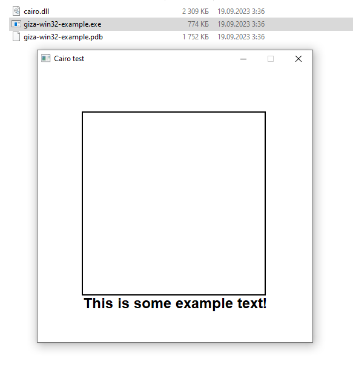

# giza-zigwin32-example

This is a simple example of using [@marler8997](https://github.com/marler8997)'s [zigwin32](https://github.com/marlersoft/zigwin32) with my [giza](https://github.com/koenigskraut/giza) cairo binding. All you need is Zig 0.11 and
```bash
zig build
```

Then go to `zig-out/bin` folder and run the thing! You will see something like this:



Zig build script will download 2.2M tar with all the necessary libraries packed into one dll, that will be stored alongside the binary for a out-of-the-box demonstration without any problems. This demo was successfully built both from Windows and Linux without any trouble.

Pre-built cairo binaries were stolen from [@preshing](https://github.com/preshing)'s [cairo-windows](https://github.com/preshing/cairo-windows) project ([latest](https://github.com/preshing/cairo-windows/releases/tag/with-tee) release).
